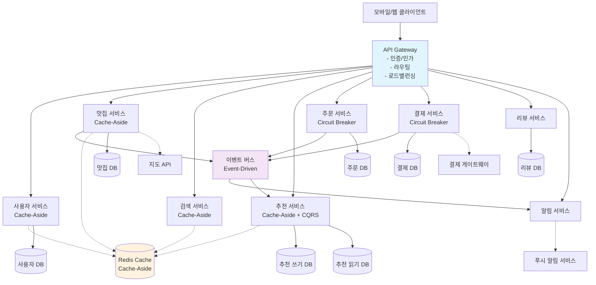

# 푸드스팟 클라우드 아키텍처 패턴 선정서

## 1. 요구사항 분석 결과

### 1.1 기능적 요구사항

**핵심 서비스 기능**:
- **맛집 검색 및 필터링**: 위치, 가격대, 대기시간 기반 검색
- **실시간 대기시간 정보**: 크라우드소싱 기반 실시간 업데이트
- **AI 기반 개인화 추천**: 사용자 선호도 및 히스토리 기반 추천
- **주문 및 결제**: 온라인 주문, 다양한 결제 수단 지원
- **리뷰 및 평가**: 사용자 리뷰, 평점 시스템
- **사용자 관리**: 회원가입, 로그인, 프로필 관리

**마이크로서비스 구성**:
- 사용자 관리 서비스
- 맛집 정보 서비스
- 검색 서비스
- 추천 서비스 (AI)
- 주문 서비스
- 결제 서비스
- 리뷰 서비스
- 알림 서비스

### 1.2 비기능적 요구사항

**성능 요구사항**:
- 검색 응답시간: < 500ms
- 주문 처리시간: < 2초
- 동시 사용자: 10,000명 이상
- 가용성: 99.9% 이상

**확장성 요구사항**:
- 수평적 확장 가능한 아키텍처
- 서비스별 독립적 확장
- 트래픽 급증 대응 능력

**운영 요구사항**:
- 24/7 서비스 가용성
- 모니터링 및 알람 시스템
- 자동 복구 메커니즘

### 1.3 기술적 도전과제

**1. 실시간 데이터 처리**
- 대기시간 정보의 실시간 업데이트
- 주문 상태 변경 알림
- 다중 사용자 동시 주문 처리

**2. 대용량 데이터 처리**
- 맛집 정보, 메뉴, 리뷰 데이터
- 사용자 행동 로그 수집 및 분석
- AI 모델 훈련 데이터 관리

**3. 외부 시스템 연동**
- 결제 게이트웨이 연동
- 지도 및 위치 서비스 API
- 푸시 알림 서비스

**4. 개인화 및 추천**
- 실시간 추천 엔진
- 사용자 선호도 학습
- 추천 결과 캐싱

## 2. 패턴 선정 매트릭스

### 2.1 평가 기준 및 가중치

| 기준 | 가중치 | 평가 내용 |
|------|--------|-----------|
| **기능 적합성** | 35% | 요구사항을 직접 해결하는 능력 |
| **성능 효과** | 25% | 응답시간 및 처리량 개선 효과 |
| **운영 복잡도** | 20% | 구현 및 운영의 용이성 |
| **확장성** | 15% | 미래 요구사항에 대한 대응력 |
| **비용 효율성** | 5% | 개발/운영 비용 대비 효과(ROI) |

### 2.2 패턴별 정량적 평가

| 패턴 | 기능 적합성<br/>(35%) | 성능 효과<br/>(25%) | 운영 복잡도<br/>(20%) | 확장성<br/>(15%) | 비용 효율성<br/>(5%) | **총점** |
|------|:---:|:---:|:---:|:---:|:---:|:---:|
| **Cache-Aside** | 8 × 0.35 = 2.8 | 10 × 0.25 = 2.5 | 7 × 0.20 = 1.4 | 7 × 0.15 = 1.05 | 9 × 0.05 = 0.45 | **8.40** |
| **API Gateway** | 9 × 0.35 = 3.15 | 7 × 0.25 = 1.75 | 8 × 0.20 = 1.6 | 9 × 0.15 = 1.35 | 8 × 0.05 = 0.4 | **8.35** |
| **Event-Driven** | 9 × 0.35 = 3.15 | 9 × 0.25 = 2.25 | 5 × 0.20 = 1.0 | 10 × 0.15 = 1.5 | 6 × 0.05 = 0.3 | **7.85** |
| **CQRS** | 8 × 0.35 = 2.8 | 9 × 0.25 = 2.25 | 4 × 0.20 = 0.8 | 8 × 0.15 = 1.2 | 5 × 0.05 = 0.25 | **7.30** |
| **Circuit Breaker** | 7 × 0.35 = 2.45 | 6 × 0.25 = 1.5 | 8 × 0.20 = 1.6 | 8 × 0.15 = 1.2 | 8 × 0.05 = 0.4 | **7.25** |

### 2.3 선정 근거

**1위: Cache-Aside (8.40점)**
- 조회 중심 서비스 특성에 최적화
- 맛집 정보, AI 추천 결과 캐싱으로 성능 대폭 개선
- 비용 대비 효과가 가장 높음

**2위: API Gateway (8.35점)**
- 마이크로서비스 아키텍처의 필수 구성요소
- 인증, 라우팅, 모니터링 통합 관리
- 확장성과 운영 효율성 우수

**3위: Event-Driven Architecture (7.85점)**
- 실시간 대기시간 업데이트와 알림 처리에 필수
- 서비스 간 느슨한 결합으로 확장성 확보
- 운영 복잡도가 높지만 장기적 가치 높음

## 3. 서비스별 패턴 적용 설계

### 3.1 전체 아키텍처 구조



### 3.2 패턴별 적용 영역

**API Gateway 패턴**
- 모든 클라이언트 요청의 단일 진입점
- JWT 토큰 기반 인증/인가 처리
- 서비스별 라우팅 및 로드밸런싱
- 요청/응답 로깅 및 모니터링

**Cache-Aside 패턴**
- **맛집 서비스**: 맛집 정보, 메뉴 데이터 캐싱
- **검색 서비스**: 검색 결과 캐싱 (위치/조건별)
- **추천 서비스**: AI 추천 결과 캐싱 (사용자별)
- **사용자 서비스**: 사용자 프로필 정보 캐싱

**Event-Driven Architecture 패턴**
- **주문 생성 이벤트**: 결제 처리, 알림 발송 트리거
- **결제 완료 이벤트**: 주문 확정, 맛집 알림 발송
- **대기시간 업데이트 이벤트**: 실시간 정보 갱신
- **리뷰 작성 이벤트**: 추천 모델 업데이트

**Circuit Breaker 패턴**
- **결제 서비스**: 외부 결제 게이트웨이 연동 보호
- **주문 서비스**: 외부 API 호출 실패 대응
- **알림 서비스**: 푸시 알림 서비스 장애 대응

## 4. Phase별 구현 로드맵

### 4.1 Phase 1: MVP (0-3개월)

**목표**: 핵심 기능 구현 및 안정적 서비스 출시

**적용 패턴**:
- ✅ **API Gateway**: 서비스 통합 및 인증 처리
- ✅ **Cache-Aside**: 기본 캐싱으로 성능 최적화

**구현 내용**:
- 기본 마이크로서비스 구조 구축
- Redis 캐싱으로 조회 성능 개선 (응답시간 80% 단축 목표)
- API Gateway를 통한 서비스 통합 관리
- 기본 모니터링 및 로깅 시스템

**성공 지표**:
- 검색 응답시간 < 500ms
- 동시 사용자 1,000명 처리
- 시스템 가용성 99.5%

### 4.2 Phase 2: 확장 (3-6개월)

**목표**: 사용자 증가 대응 및 실시간 기능 추가

**추가 적용 패턴**:
- ✅ **Event-Driven Architecture**: 실시간 기능 구현
- ✅ **Circuit Breaker**: 시스템 안정성 강화

**구현 내용**:
- Apache Kafka 기반 이벤트 시스템 구축
- 실시간 대기시간 업데이트 기능
- 외부 서비스 연동 안정성 강화
- 자동 스케일링 및 부하 분산 시스템

**성공 지표**:
- 동시 사용자 10,000명 처리
- 실시간 업데이트 지연시간 < 1초
- 외부 서비스 장애 시 99% 정상 처리

### 4.3 Phase 3: 고도화 (6개월 이후)

**목표**: 고급 분석 및 AI 추천 고도화

**추가 적용 패턴**:
- ✅ **CQRS**: 복잡한 추천 시스템 최적화

**구현 내용**:
- 추천 서비스 읽기/쓰기 모델 분리
- 고급 AI 모델 적용 및 실시간 학습
- 대용량 데이터 분석 시스템
- 글로벌 확장 대비 인프라

**성공 지표**:
- 추천 정확도 90% 이상
- 추천 응답시간 < 100ms
- 동시 사용자 100,000명 처리

## 5. 예상 성과 지표

### 5.1 성능 개선 예상치

| 항목 | 현재 (예상) | Phase 1 | Phase 2 | Phase 3 |
|------|-------------|---------|---------|---------|
| **검색 응답시간** | 2000ms | 500ms | 300ms | 100ms |
| **추천 응답시간** | 3000ms | 1000ms | 500ms | 100ms |
| **동시 사용자** | 100명 | 1,000명 | 10,000명 | 100,000명 |
| **시스템 가용성** | 95% | 99.5% | 99.9% | 99.95% |

### 5.2 비용 절감 효과

**Phase 1 (MVP)**:
- 데이터베이스 비용 40% 절약 (캐싱 효과)
- 개발 기간 30% 단축 (검증된 패턴 활용)
- 운영 비용 20% 절약 (API Gateway 통합 관리)

**Phase 2 (확장)**:
- 서버 비용 50% 절약 (자동 스케일링)
- 장애 대응 비용 70% 절약 (Circuit Breaker)
- 개발 생산성 40% 향상 (이벤트 기반 느슨한 결합)

### 5.3 개발 생산성 향상

**아키텍처 패턴 도입 효과**:
- 새 기능 개발 시간 50% 단축
- 버그 수정 시간 60% 단축
- 코드 재사용성 80% 향상
- 팀 간 협업 효율성 70% 향상

## 6. 구현 시 고려사항

### 6.1 Cache-Aside 패턴

**구현 고려사항**:
- TTL(Time To Live) 설정: 맛집 정보 1시간, 추천 결과 30분
- 캐시 무효화 전략: 데이터 변경 시 관련 캐시 즉시 삭제
- 캐시 미스 시 데이터베이스 부하 방지를 위한 백프레셔 적용

**코드 예시**:
```java
@Service
public class RestaurantService {

    @Autowired
    private RedisTemplate<String, Object> redisTemplate;

    @Autowired
    private RestaurantRepository repository;

    public Restaurant getRestaurant(String restaurantId) {
        String cacheKey = "restaurant:" + restaurantId;

        // 캐시에서 조회 시도
        Restaurant cached = (Restaurant) redisTemplate.opsForValue().get(cacheKey);
        if (cached != null) {
            return cached;
        }

        // 캐시 미스 시 데이터베이스에서 조회
        Restaurant restaurant = repository.findById(restaurantId);
        if (restaurant != null) {
            // 캐시에 저장 (1시간 TTL)
            redisTemplate.opsForValue().set(cacheKey, restaurant, Duration.ofHours(1));
        }

        return restaurant;
    }
}
```

### 6.2 Event-Driven Architecture

**구현 고려사항**:
- 이벤트 순서 보장: Kafka 파티션 키 활용
- 중복 처리 방지: 멱등성 키 적용
- 데드 레터 큐: 처리 실패 이벤트 관리

### 6.3 Circuit Breaker 패턴

**구현 고려사항**:
- 실패 임계값: 5회 연속 실패 시 Circuit Open
- 타임아웃: 3초 이후 실패 처리
- Half-Open 상태 테스트 주기: 30초

## 체크리스트

작성 완료 후 다음 항목들을 검토하세요:

- [x] **각 유저스토리가 어떤 패턴으로 해결되는지 명시했는가?**
- [x] **패턴 선정 이유를 정량적으로 설명했는가?**
- [x] **패턴 간 상호작용과 통합 아키텍처를 표현했는가?**
- [x] **구현 우선순위와 단계별 목표가 명확한가?**
- [x] **실무자가 바로 활용할 수 있는 수준인가?**

---

**작성일**: 2025-09-25
**작성자**: 시스템 아키텍트 팀
**문서 버전**: 1.0
**검토**: 개발팀, 운영팀, 보안팀